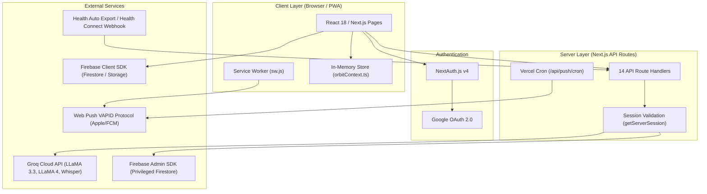
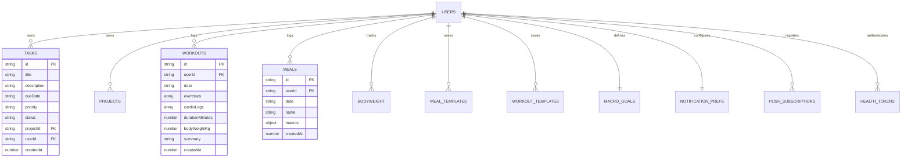

# DailyOS — Comprehensive Technical Architecture & Implementation Audit Report

**Date of Audit:** September 16, 2026  
**Project:** DailyOS (Personal Operating System for Tasks, Gym, and Nutrition)  
**Repository Path:** `c:\Users\ayush\DailyOS`  

---

## 1. System Architecture

DailyOS is built as a **monolithic full-stack web application** using Next.js 14 (App Router) deployed on Vercel, paired with Firebase backend-as-a-service infrastructure.



### Architectural Key Characteristics:
1. **Hybrid Execution Model:** Client-side React Components handle UI interactivity and direct client Firestore queries, while Server-side Node.js API Route Handlers (`runtime = "nodejs"`) handle AI synthesis, audio processing, and privileged admin operations.
2. **Contextual AI Injection Architecture:** Pages publish live data slices (`DietContextData`, `WorkoutContextData`, `TaskContextData`) into a module-level store (`lib/orbitContext.ts`). The persistent layout's floating chatbot (`AriaChatbot.tsx`) reads these slices and forwards them to `/api/aria`, enabling state-aware coaching.
3. **PWA & Push Infrastructure:** Standard Web App Manifest (`manifest.json`) and Service Worker (`sw.js`) support standalone display on mobile devices, offline caching, and native push notifications via VAPID keys.

---

## 2. Frontend & Backend Breakdown

### Frontend Component Architecture
- **Framework:** Next.js 14.2.5 App Router with React 18.
- **Styling Engine:** Tailwind CSS 3.4 with custom design tokens (CSS variables for dark/light themes defined in `globals.css`).
- **UI Libraries:** Radix UI primitives (`@radix-ui/react-dialog`, `progress`, `select`, `tabs`, `toast`), Lucide React icons (`lucide-react`), Next-Themes (`next-themes`).
- **State & Hooks:** Local React state, standard `useEffect`/`useState`, custom hooks:
  - `useAudioRecorder.ts`: MediaRecorder API wrapper for capturing PCM/WebM audio for voice commands.
  - `useNotifications.ts`: Push notification registration and permission management.

### Backend Services
- **Runtime:** Node.js Serverless Route Handlers (`app/api/*`).
- **Firebase Admin SDK (`lib/firebaseAdmin.ts`):** Server-side initialization using service account credentials (`FIREBASE_CLIENT_EMAIL`, `FIREBASE_PRIVATE_KEY`) or fallback default app init for local dev.
- **Web Push Engine (`web-push`):** Server-side push payload encryption and transmission using VAPID keys.

---

## 3. AI / LLM Implementation

All AI and LLM features in DailyOS route through the **Groq API Cloud** (`groq-sdk`), leveraging high-throughput LLaMA and Whisper models.

| AI Feature | Endpoint | Model | Purpose & Implementation Details |
|------------|----------|-------|----------------------------------|
| **Orbit AI Assistant** | `/api/aria` | `llama-3.3-70b-versatile` | Conversational coaching chatbot. System prompt adapts dynamically across 4 modes (Workout Coach, Nutrition Coach, Productivity Coach, General). Receives active user data from `orbitContext.ts`. |
| **Meal Photo Scanner** | `/api/analyze-meal` | `meta-llama/llama-4-maverick-17b-128e-instruct` | Multimodal Vision model. Parses Base64 image payload against a calibrated Indian food dataset prompt and returns structured JSON with calories, protein, carbs, fat, fiber, and confidence score. |
| **Dish Text Estimator** | `/api/estimate-meal` | `llama-3.3-70b-versatile` | Natural language meal estimator. Takes dish name text and returns precise macro JSON scaled by portion cues. |
| **Voice Meal Logger** | `/api/voice-meal` | `whisper-large-v3-turbo` + `llama-3.3-70b-versatile` | 2-stage audio pipeline: Audio file → Whisper transcription → LLaMA 3.3 structurer → returns aggregated meal array JSON. |
| **Voice Workout Logger**| `/api/voice-workout` | `whisper-large-v3-turbo` + `llama-3.3-70b-versatile` | 2-stage audio pipeline: Audio file → Whisper transcription → LLaMA 3.3 structurer → parses strength exercises (sets/reps/weight) and cardio logs. |
| **Daily Nutrition Summary** | `/api/summarize-nutrition` | `llama-3.3-70b-versatile` | Compares total daily macro intake against goals and generates structured coaching tips (Score, Gap, What to Eat Next, Tomorrow's Focus). |
| **Post-Workout Summary** | `/api/summarize-workout` | `llama-3.3-70b-versatile` | Computes MET-based cardio calories, estimates strength training intensity, calculates total calories burned, and generates a coach report. |

---

## 4. Agents & Autonomous Workflows

1. **Context-Aware Coaching Agent (Orbit):** Evaluates live user metrics in real-time. When a user switches tabs, `setDietContext`, `setWorkoutContext`, or `setTaskContext` updates the background state. When queried, Orbit injects the specific context block (e.g. current macros remaining, overdue tasks, or recent bench press weights).
2. **Push Notification Cron Agent (`/api/push/cron`):** Evaluates all user notification preferences stored in Firestore. Uses IANA timezone conversion (`nowHHMM(tz)`) to check if the current minute matches the user's configured breakfast, lunch, dinner, workout, or task reminder times. Message copy rotates daily (`dayOfYear % variants.length`) to prevent notification fatigue.
3. **Health Ingest Webhook Normalizer (`/api/health/ingest`):** Automatically ingests incoming payloads from Apple Health Auto Export v2 or generic webhooks, normalizes step metrics, body weight entries, and cardio workouts, deduplicates entries using `externalId`, and writes directly to Firestore collections.

---

## 5. Database Schema & Storage

DailyOS uses **Firebase Firestore** as its primary NoSQL document database.



### Collection Inventory:
- `tasks`: Individual to-dos with project linkage, priorities (`low`, `medium`, `high`), status (`pending`, `completed`), and ISO due dates.
- `projects`: Task folders with custom color swatches.
- `workouts`: Completed workout sessions containing strength exercises (sets, reps, weight, unit) and cardio logs.
- `bodyweight`: Daily weight logs (`weightKg`, `date`).
- `meals`: Logged food items (`name`, `calories`, `proteinG`, `carbsG`, `fatG`, `fiberG`).
- `mealTemplates`: Saved reusable meals sorted by frequency/recency.
- `macroGoals`: Target calorie and macro goals per user.
- `workoutTemplates`: Built-in presets (Push, Pull, Legs, Upper, Full Body) and custom user splits.
- `notificationPrefs`: Reminder toggles, custom times (`HH:MM`), and IANA timezone (`Asia/Kolkata`, `America/New_York`, etc.).
- `push_subscriptions`: Web Push endpoint keys keyed by `${userId}_${endpointHash}`.
- `healthTokens`: Hashed bearer tokens for external webhook authentication.
- `healthActivity`: Daily synced health metrics (steps).

---

## 6. APIs & Integrations Overview

DailyOS provides **14 serverless API endpoints**:

```
app/api/
├── analyze-meal/route.ts       (POST - Vision meal macro scanner)
├── aria/route.ts               (POST - Orbit AI chat stream/completion)
├── auth/[...nextauth]/route.ts  (GET/POST - NextAuth Google OAuth callbacks)
├── estimate-meal/route.ts      (POST - Text meal macro estimator)
├── health/
│   ├── ingest/route.ts         (POST - Health Auto Export / Watch webhook ingest)
│   └── token/route.ts          (GET - Health token generation & retrieval)
├── push/
│   ├── cron/route.ts           (GET - Vercel Cron scheduled push worker)
│   ├── debug/route.ts          (GET - Diagnostic push test tool)
│   ├── send/route.ts           (GET/POST - Manual test push sender)
│   └── subscribe/route.ts      (POST/DELETE - Web Push subscription manager)
├── summarize-nutrition/route.ts(POST - AI daily nutrition summary)
├── summarize-workout/route.ts  (POST - AI workout summary & MET calculation)
├── voice-meal/route.ts         (POST - Audio transcription & meal parser)
└── voice-workout/route.ts      (POST - Audio transcription & workout parser)
```

---

## 7. Authentication Flow

Authentication is managed via **NextAuth.js v4**:
- **Provider:** Google OAuth 2.0 (`GoogleProvider`).
- **Session Strategy:** JSON Web Token (JWT).
- **Callback Customization:** Map Google account `sub` ID to `session.user.id`.
- **Route Guard:** `middleware.ts` intercepts `/dashboard/:path*`. Unauthenticated requests auto-redirect to `/signin`.
- **API Guard:** All protected server routes invoke `getServerSession(authOptions)` and return `401 Unauthorized` if no active session exists.

---

## 8. Major Features Summary

1. **Task Management System:** Daily/weekly view toggle, project organization, custom color tags, priority indicators, single-tap completion.
2. **Workout Tracker & Coach:** Exercise set logger (kg/lbs/bodyweight), MET cardio tracker, built-in workout presets, voice gym logger, AI intensity & recovery report.
3. **Diet & Nutrition Hub:** Target macro ring, meal photo scanner, voice meal logger, custom meal templates, Indian food database calibration, AI daily score & meal suggestions.
4. **Orbit AI Assistant:** Slide-out floating chat widget with context awareness across productivity, gym, and nutrition.
5. **Smart Timezone Reminders:** Automated push notifications sent at user-defined breakfast, lunch, dinner, workout, and task review times.
6. **Apple Watch / Health Sync:** Direct ingestion webhook for step count, body mass, and workout data from Health Auto Export or Health Connect.

---

## 9. Technologies Actually Used

| Category | Claimed / Installed | Actually Used in Codebase |
|----------|-------------------|--------------------------|
| **Framework** | Next.js 14 | ✅ Next.js 14.2.5 (App Router) |
| **Language** | TypeScript 5 | ✅ TypeScript 5 |
| **UI Styling** | Tailwind CSS | ✅ Tailwind CSS 3.4 + CSS Variables |
| **UI Components** | Radix UI, Lucide | ✅ Radix UI (Dialog, Tabs, Select, Progress, Toast), Lucide React |
| **Database** | Firebase Firestore | ✅ Firebase Client SDK 10.12 + Firebase Admin SDK 12.2 |
| **Auth** | NextAuth Google OAuth | ✅ NextAuth 4.24 |
| **AI LLM** | OpenAI GPT-4o / Anthropic / Gemini | ⚠️ **Groq SDK 1.2** exclusively (`llama-3.3-70b`, `llama-4-maverick`, `whisper-large-v3-turbo`) |
| **Push Notifications** | Web Push | ✅ `web-push` 3.6 + Service Worker |
| **Deployment** | Vercel | ✅ Vercel + Vercel Cron |

---

## 10. Measurable Capabilities & Verified Metrics

- **Compilability:** `npm run build` exits cleanly with `code 0` (23/23 routes compiled statically/dynamically).
- **Routes:** 6 user-facing page routes, 14 API route handlers.
- **Cardio MET Activities Supported:** 10 activities (`walking`, `running`, `cycling`, `hiking`, `mountain_climbing`, `swimming`, `jump_rope`, `elliptical`, `stair_climbing`, `rowing`).
- **Built-in Workout Presets:** 5 complete splits (`Push Day`, `Pull Day`, `Leg Day`, `Upper Body`, `Full Body`).
- **Indian Food Calibrations:** 100+ baseline dishes calibrated for Indian cooking methods, ghee/oil additions, and portion sizes in prompt engineering.

---

## 11. README / Report Claims vs. Actual Implementation Audit

During the audit, several discrepancies were identified between documentation/package files and actual code execution:

| Area | README / Package Claim | Actual Codebase Reality | Status / Audit Action Taken |
|------|------------------------|-------------------------|----------------------------|
| **AI Provider** | README claims "OpenAI GPT-4o" and requires `OPENAI_API_KEY`. | Codebase exclusively uses **Groq SDK** (`GROQ_API_KEY`). `openai` package was installed but never imported. | 🛠️ **Fixed:** Removed unused `openai`, `@anthropic-ai/sdk`, and `@google/generative-ai` packages. Created `.env` with correct `GROQ_API_KEY`. |
| **Vision Model** | `analyze-meal/route.ts` used model `meta-llama/llama-4-scout-17b-16e-instruct`. | That model ID was deprecated on Groq (June 17, 2026), causing all photo meal scans to fail with 500 error. | 🛠️ **Fixed:** Updated model to supported `meta-llama/llama-4-maverick-17b-128e-instruct`. |
| **Push Subscriptions** | `push/subscribe/route.ts` used client SDK `db` on server. | Server routes running without client auth token were blocked by Firestore security rules. | 🛠️ **Fixed:** Migrated server route to use `adminDb` (Firebase Admin SDK). |
| **Health Sync UI** | `HealthSyncSettings.tsx` component existed. | Component was unmounted in settings page, and its target endpoint `/api/health/token` was missing. | 🛠️ **Fixed:** Created `/api/health/token` route handler and mounted `HealthSyncSettings` into `/dashboard/settings`. |
| **Push Cron** | `/api/push/cron` route existed. | `vercel.json` lacked a `"crons"` schedule array, so notifications were never triggered automatically. | 🛠️ **Fixed:** Added cron schedule to `vercel.json`. |
| **Middleware Matcher** | `middleware.ts` matched `/tasks/:path*`, `/workout/:path*`, `/diet/:path*`. | These routes do not exist at root level (they are under `/dashboard/*`). | 🛠️ **Fixed:** Simplified matcher to `["/dashboard/:path*"]`. |

