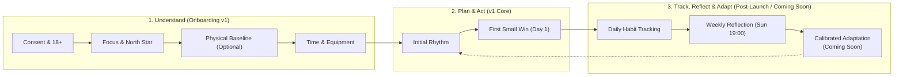
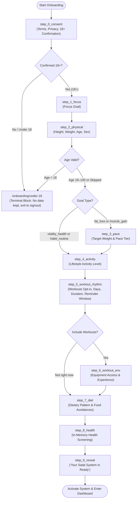

# Satat — Onboarding & Baseline Personalization Specification

**Document Version:** 2.3 (Feature Planner Revision — System & Mathematical Hardening)  
**Status:** PROPOSED — Pending Product Owner, Qualified Clinical/Dietetic, Legal, and Qualified Trainer Review  
**Target Release:** Satat v1.0 Core  
**Applicable Rules:** `docs/AI_RULES.md` (§0, §3), `docs/PRD.md` (§3, §5, §6, §7), `docs/ARCHITECTURE.md` (§5, §7), `docs/MEMORY.md`  

> [!CAUTION]
> **FORMAL LAUNCH BLOCKERS:**
> 1. **Clinical & Dietetic Review:** Production nutrition and health recommendation logic must not be released publicly until the proposed formulas, calorie policies, macro policies, and Health-Sensitive Mode behaviors have been reviewed and approved by a qualified nutrition and medical professional.
> 2. **Qualified Trainer Review:** Starter workout composition rules and exercise progressions must be reviewed and approved by a certified personal trainer (CSCS / equivalent) before release.
> 3. **Legal & Privacy Review:** Final legal review of the consent screen, data minimization audit, draft retention policy, and DPDP/GDPR statements prior to public user intake.
> 4. **Invariant Test Suite:** All 12 property/invariant tests in §15 must pass in CI without regression.

---

## 1. Product Intent & The Satat Philosophy

### 1.1 The Satat Philosophy
The product is built on **Satat** (*सतत* — continuity, persistence, sustainable endurance). Conventional fitness applications treat onboarding as an authoritative diagnostic intake that prescribes rigid, permanent calorie and workout targets. When users inevitably encounter normal life friction, rigid targets produce guilt, perceived failure, and abandonment.

Satat replaces this failure cycle with a continuous learning loop:
$$\text{Understand} \longrightarrow \text{Plan} \longrightarrow \text{Act} \longrightarrow \text{Track} \longrightarrow \text{Reflect} \longrightarrow \text{Adapt} \longrightarrow \text{Improve}$$

Onboarding represents strictly the initial **Understand** step. Its purpose is to establish an **initial personal baseline** — a starting working hypothesis. Satat does not claim to know a user's exact metabolic expenditure on Day 1. Instead, it builds a safe, realistic starter rhythm, guides the user to take their first small action immediately, and establishes a foundation for future learning.



> [!NOTE]
> **ADAPTATION CAPABILITY STATUS:** Automated dynamic calorie recalibration and algorithmic plan adaptation based on weight trends are **Post-Launch Capabilities (Coming Soon)** (PRD §9). In v1 Core, onboarding establishes the **Initial Personal Baseline** only.

---

### 1.2 Core Intent & Non-Negotiables
1. **Estimate, Not Prescription:** Every energy calculation is explicitly communicated as an *estimated daily energy baseline*, never an exact physiological requirement.
2. **Minimum Effective Intake:** Never ask questions that do not materially alter the starter plan. Collect the minimum information required on Day 1, and learn the rest progressively.
3. **No Fake Defaults:** Never insert fictional physiological or behavioral attributes. Age, height, weight, sex, activity, target weight, pace, dietary pattern, and equipment have **no preselected defaults and no fallback assumptions**. If an optional value is skipped, it is persisted as `null`, and dependent calculations are deferred (or explicitly displayed as unavailable). No fictional user attribute (such as an age-30 anchor, sedentary fallback, $\pm 5\text{kg}$ target weight, steady pace, or 'anything' dietary pattern) is ever silently invented.
4. **Adaptive Branching:** A responsive flow targeting 90–150 seconds. Irrelevant questions are branched away (e.g. habit-only users do not configure barbells).
5. **Contextual Permissions:** Push notification requests are **removed** from initial onboarding. Notifications are requested contextually when the user schedules their first workout or meal reminder.
6. **Separation of Policy:** Clear boundaries between mathematical formulas (Mifflin-St Jeor), proposed product nutrition policy (deficit sizing, macro splits), and clinical safety policy. All formulas and nutrition policies are **PROPOSED POLICY ONLY** until reviewed and approved by a qualified clinical professional.
7. **Uncertainty Represented Honestly:** When biological sex is omitted, Satat calculates an uncertainty range rather than selecting a single sex-specific target or female anchor. Single-point calorie targeting is deferred (`targetCalories: null`, `macro targets: null`).
8. **Health-Sensitive Mode:** Health screening answers are held in memory only, never stored in drafts. In v1, `HEALTH_SENSITIVE` mode is condition-agnostic: it disables aggressive goals, withholds calorie recommendations where indicated (`nutritionStatus: "withheld_health_sensitive"`), provides clinical guidance notices, and withholds automated workout routines by default. Physical injury suppresses starter workout routines without suppressing nutrition tracking.
9. **Feasibility Enforcement:** The macronutrient allocation engine enforces feasibility checks before outputting targets. If constraints cannot all be satisfied simultaneously, the engine returns an explicit `nutritionStatus: "infeasible_constraints"` state rather than violating constraints, producing negative macros, or fabricating numbers.
10. **Targets-Null First-Class Handling:** When targets are null (omitted baseline, sex omitted, health-sensitive withholding, or infeasible constraints), Diet Page, Home View, Summarize-Nutrition AI, and Orbit context render rich intuitive habit tracking modes without falling back to hardcoded `2000/150/200/65` defaults.

---

## 2. The User Journey: From Sign-In to First Win

The onboarding experience is designed to take between **90 and 150 seconds**.

```text
Google Sign-in 
  └──> First-Time Detection (Dashboard Guard in app/dashboard/layout.tsx)
         └──> /onboarding (Dedicated top-level clean route outside /dashboard)
                ├── Step 0: Consent & 18+ Confirmation (step_0_consent)
                │      └──> [If Age < 18] ──> /onboarding/under-18 (Terminal Screen, No Data Kept)
                ├── Step 1: Identity & North Star (step_1_focus)
                ├── Step 2: Physical Baseline (step_2_physical — Optional / Skip)
                ├── Step 3: Sustainable Pace & Target (step_3_pace — Branched: Fat Loss / Muscle Gain)
                ├── Step 4: Daily Life & Non-Exercise Movement (step_4_activity — Optional / Skip)
                ├── Step 5: Movement Opt-in & Schedule (step_5_workout_rhythm)
                ├── Step 6: Training Environment & Experience (step_6_workout_env — Branched: If Workouts)
                ├── Step 7: Everyday Fuel Pattern (step_7_diet — Optional / Skip)
                ├── Step 8: Health & Medical Safety Harbor (step_8_health — In-memory only)
                └── Step 9: System Reveal ("Your Satat System Is Ready" — step_9_reveal)
                       └──> /dashboard (Session updated; prompts First Small Win)
```

### The "First Small Win" Focus
Upon entering `/dashboard`, the user is not greeted by empty charts. Satat presents a single, low-friction **First Action** card matched to their primary focus:
- **Nutrition Focus:** *"Log your first meal (or snack)"* via voice, text, or photo.
- **Movement Focus:** *"Review today's starter workout session"* (1 tap to view beginner movements).
- **Habit Focus:** *"Confirm your daily hydration or evening task list"*.

---

## 3. Canonical Step List & Adaptive Flow Architecture

### 3.1 Canonical Step List
The following 10 step identifiers are the **single source of truth** used across UI wizard state, draft persistence (`lastStepCompleted`), server validation, resume routing, and analytics:

| Canonical Step Identifier | Display Name | Purpose & Inputs |
|---|---|---|
| `step_0_consent` | Consent & Eligibility | Terms, Privacy Policy, explicit 18+ confirmation, AI processing consent |
| `step_1_focus` | North Star Focus | Primary 12-week focus (`focusGoal`) |
| `step_2_physical` | Physical Baseline | Height, Weight, Age, Biological Sex (with skip option) |
| `step_3_pace` | Sustainable Pace | Target Weight, Pace Tier (Branched: `fat_loss` and `muscle_gain` only) |
| `step_4_activity` | Daily Movement | Non-exercise lifestyle activity level (`activityLevel`) |
| `step_5_workout_rhythm` | Movement Schedule | Opt-in toggle, days/week, time/session, preferred reminder window |
| `step_6_workout_env` | Training Tools | Equipment access, lifting experience (Branched: if workouts opted-in) |
| `step_7_diet` | Fuel Preferences | Everyday dietary pattern, food avoidances / allergens |
| `step_8_health` | Health Safety Harbor | In-memory clinical screening & physical injury checks |
| `step_9_reveal` | System Reveal | "Your Satat System Is Ready" starter summary & activation |

---

### 3.2 Adaptive Branching Flowchart



---

## 4. Question & Field Catalogue

### Step 0: Consent & Age Eligibility (`step_0_consent`)
- **Fields:** `consentGivenAt`, `consentVersion`, `confirmedAge18Plus`
- **Classification:** Mandatory Pre-Condition.
- **Screen Copy:**
  - Headline: *"Welcome to Satat"*
  - Subhead: *"Before we begin, please review how Satat supports your daily habits."*
  - Body: *"Satat is a daily habit companion designed for adults. Satat provides lifestyle estimates, habit tracking, and structured movement routines. Satat does not provide medical therapy, eating disorder treatment, or pediatric growth tracking."*
  - Links: [Privacy Policy](/privacy) · [Terms of Service](/terms)
- **Checkboxes (Must be explicitly checked):**
  - [ ] *"I confirm that I am 18 years of age or older."*
  - [ ] *"I agree to the Terms of Service and Privacy Policy, and consent to processing my entries to generate my baseline rhythm."*
- **Under-18 Outcome (Adolescent Safety Architecture):**
  - If the user indicates they are under 18 (unchecks 18+ or enters age $< 18$ in Step 2):
    1. **Zero Data Kept:** In-memory state is wiped. No draft is persisted to `/api/onboarding/progress` or Firestore. No session cookie marking eligibility is set.
    2. **No Redirect Loop:** User is transitioned to a clean terminal route `/onboarding/under-18`. The dashboard route guard checks `session` and does **not** redirect `/onboarding/under-18` to `/dashboard`.
    3. **What the User Sees:**
       > *"Satat is currently designed and clinically calibrated for adult metabolic baselines. During adolescence, healthy growth, hormone balance, and bone development require personalized guidance from a pediatrician or registered sports dietitian rather than automated adult models."*
       Provides helpful educational links to pediatric sports nutrition resources and a prominent **"Sign Out"** button (`signOut({ callbackUrl: "/" })`).

---

### Step 1: North Star Focus (`step_1_focus`)
- **Field:** `focusGoal`
- **Classification:** Required.
- **Question:** *"What is your main focus for the next 12 weeks?"*
- **Helper Copy:** *"This helps Satat shape your starting routine and daily energy estimates."*
- **Input Type:** Visual selection card (single select, starts unselected).
- **Options:**
  - `fat_loss`: **Build a Leaner Body** — Reduce body fat sustainably while protecting energy and muscle.
  - `muscle_gain`: **Build Strength & Muscle** — Fuel training performance and progressive overload.
  - `vitality_health`: **Boost Daily Energy & Health** — Maintain a steady weight, eat cleaner, and move consistently.
  - `habit_routine`: **Build Consistent Habits** — Establish a structured daily rhythm for meals, workouts, and sleep.
- **Validation:** String enum in `["fat_loss", "muscle_gain", "vitality_health", "habit_routine"]`.
- **Default:** None. Skippable: No.

---

### Step 2: Physical Baseline (`step_2_physical`)
- **Fields:** `heightCm`, `weightKg`, `age`, `biologicalSex`
- **Classification:** Optional / Progressive Profiling (Required only for immediate calorie estimates).
- **Question:** *"What is your current physical baseline?"*
- **Helper Copy:** *"Used strictly to estimate resting energy expenditure and baseline protein targets. Never displayed publicly or shared."*
- **Inputs:**
  - Unit Toggle: Metric (`cm`, `kg`) default; Imperial (`ft/in`, `lbs`) switchable at any time.
  - Height & Weight inputs (number inputs, start empty).
  - Age (integer input, starts empty).
  - Biological Sex: 3 options (`Female`, `Male`, `Prefer not to say`, starts unselected).
- **Validation Rules & Age Logic:**
  - `heightCm`: Optional float. Bounds: $120.0$ to $230.0$ cm.
  - `weightKg`: Optional float. Bounds: $35.0$ to $250.0$ kg.
  - `age`: Optional integer.
    - Age $< 18$: Triggers immediate **Adult Onboarding Eligibility Block** (navigates to `/onboarding/under-18`; API responds with 422).
    - Age $18$ to $100$: Eligible for adult calculations.
    - Age $> 100$: Rejected as invalid input (API responds with 400).
  - `biologicalSex`: Optional enum `["female", "male", "prefer_not_to_say"]`.
    - If `prefer_not_to_say` or omitted: Satat calculates an uncertainty range between male and female formulas. Single-point calorie targeting is deferred (`targetCalories: null`, `macro targets: null`).
- **Default:** None. Skippable: Yes (Tapping *"Skip physical baseline for now"* persists `null`).

---

### Step 3: Sustainable Pace & Target (`step_3_pace`)
*Branched: Rendered only if `focusGoal` is `fat_loss` or `muscle_gain`.*
- **Fields:** `targetWeightKg`, `paceTier`
- **Classification:** Optional / Progressive Profiling.
- **Question:** *"How would you like to pace your journey?"*
- **Helper Copy:** *"Satat prioritizes consistency over aggressive speed. Slower paces protect lean muscle and hormone health."*
- **Inputs:**
  - Target Weight (optional): Numeric input in active units (starts empty).
  - Pace Tier (optional, starts unselected):
    - **For Fat Loss:**
      - `relaxed`: Gentle (~0.23 kg / week) — Subtle energy shift, minimal hunger.
      - `steady`: Steady (~0.36 kg / week) — Balanced, sustainable fat loss.
      - `fast`: Intensive (~0.55 kg / week) — Structured tracking *(Capped at 20% TDEE and 1% bodyweight/wk; disabled in Health-Sensitive Mode)*.
    - **For Muscle Gain:**
      - `relaxed`: Lean Growth (~0.14 kg / week) — Minimal fat gain, high quality.
      - `steady`: Steady Growth (~0.23 kg / week) — Balanced strength and hypertrophy.
      - `fast`: Accelerated Growth (~0.36 kg / week) — Higher caloric surplus.
- **Engine Rules & Deficit Cap (PROPOSED):**
  - **Universal Deficit Cap:** A maximum deficit cap of **$\le 20\%$ of TDEE (PROPOSED)** is applied to **ALL fat-loss tiers** (not just `fast`).
  - **1% Bodyweight Limit:** Deficit must not exceed $11 \times W_{\text{kg}}\text{ kcal/day}$ ($1.0\%$ of bodyweight per week based on $7,700\text{ kcal/kg}$).
  - **Dynamic Pace Label Computation:** Pace rate labels are dynamically computed from the *applied* deficit:
    $$\text{Rate (kg/week)} = \frac{\Delta_{\text{applied}}}{1,100}\text{ kg/week}$$
  - **Monotonicity Enforcement:** Calories must strictly never increase as pace increases:
    $$C_{\text{target}}(\text{fast}) \le C_{\text{target}}(\text{steady}) \le C_{\text{target}}(\text{relaxed})$$
- **Default:** None. Skippable: Yes (persists `null`).

---

### Step 4: Daily Life & Non-Exercise Movement (`step_4_activity`)
- **Field:** `activityLevel`
- **Classification:** Required for Nutrition Targets; Optional for Habit-Only users.
- **Question:** *"How does your body move during a typical day (outside exercise)?"*
- **Helper Copy:** *"Your daily work and commuting routine (NEAT) accounts for far more energy burn than a 45-minute workout."*
- **Input Type:** 4 descriptive lifestyle cards (no preselection).
- **Options:**
  - `sedentary`: **Mostly Seated** — Desk job, remote work, driving, reading ($1.200$).
  - `lightly_active`: **On Your Feet Part-Time** — Teaching, retail, walking around the house/office, 5,000–8,000 steps ($1.375$).
  - `moderately_active`: **Constantly Moving** — Active commute, hospitality, trades, childcare, 10,000+ steps ($1.550$).
  - `very_active`: **Physically Demanding** — Heavy manual labor, farming, competitive athletic training ($1.725$).
- **Default:** None. Skippable: Yes (persists `null`; calorie targeting deferred).

---

### Step 5: Movement Opt-in & Schedule (`step_5_workout_rhythm`)
- **Fields:** `includeWorkouts`, `workoutDaysPerWeek`, `availableTrainingTimeMinutes`, `preferredTrainingWindow`
- **Classification:** Required for Starter Workout Routine.
- **Question:** *"What is a realistic training rhythm you can sustain?"*
- **Helper Copy:** *"A 30-minute session you complete every week beats a 90-minute plan you abandon."*
- **Inputs:**
  - Selection: *"Do you want Satat to include a starter workout routine?"*
    - Options: `Yes, include a starter routine` / `Not right now, focus on nutrition & habits`.
    - Starts unselected.
  - Frequency (if Yes): Pill selector (`2`, `3`, `4`, `5` sessions per week, starts unselected).
  - Available Time per Session (if Yes):
    - `<20 min`: Express micro-sessions.
    - `20–30 min`: Efficient, focused workouts.
    - `30–45 min`: Standard balanced training.
    - `45–60 min`: Comprehensive training.
    - `60+ min`: Extended volume.
  - Preferred Training Window (Optional):
    - `morning` | `afternoon` | `evening` | `flexible`
    - **Feature Mapping:** Used directly to configure initial workout reminder time in `notificationPrefs`:
      - `morning` $\to$ 07:00
      - `afternoon` $\to$ 12:30
      - `evening` $\to$ 18:00
      - `flexible` $\to$ reminder disabled / manual
- **Default:** None. Skippable: Yes (If "Not right now", `includeWorkouts: false`).

---

### Step 6: Training Tools & Experience (`step_6_workout_env`)
*Branched: Rendered only if `includeWorkouts: true`.*
- **Fields:** `equipmentAccess`, `trainingExperience`
- **Classification:** Required for Starter Workout Routine.
- **Question:** *"Where will you do your workouts and what is your experience?"*
- **Inputs:**
  - Equipment Access:
    - `commercial_gym`: **Commercial / Full Gym** — Barbells, dumbbells, cable machines, racks.
    - `home_dumbbells`: **Home with Dumbbells & Bench** — Adjustable weights and bodyweight bars.
    - `bodyweight_only`: **Anywhere / Bodyweight** — No equipment needed, calisthenics and floor movements.
  - Experience Level:
    - `beginner`: New to lifting or returning after a long break ($< 6$ months consistent).
    - `intermediate`: Familiar with progressive overload and main exercise forms ($6$ months – $2$ years).
    - `advanced`: Confident with self-directed programming ($2+$ years).
- **Default:** None. User must select. Skippable: No (if workouts included).

---

### Step 7: Everyday Fuel Pattern (`step_7_diet`)
- **Fields:** `dietaryPattern`, `foodAvoidances`
- **Classification:** Required for Macro Split; Optional for Habit-Only.
- **Question:** *"What is your everyday eating style?"*
- **Inputs:**
  - Dietary Pattern (Single Choice — starts unselected):
    - `vegetarian`: **Vegetarian** (Dairy included, no meat or eggs)
    - `eggetarian`: **Eggetarian** (Eggs & dairy included, no meat)
    - `non_vegetarian`: **Non-Vegetarian** (Poultry, fish, meat included)
    - `vegan`: **Vegan** (100% plant-based, no animal products)
    - `anything`: **No Specific Dietary Restriction**
  - Common Food Avoidances (Multi-select optional tags):
    - `Lactose / Dairy`, `Gluten`, `Nuts`, `Soy`, `Seafood`
    - **Feature Mapping:** Injected into AI meal logging and recipe prompts (`dish-vocab` filter and Groq prompt context) to prevent suggesting avoided allergens/ingredients.
- **Default:** None. Skippable: Yes (`dietaryPattern: null`, `foodAvoidances: []`).

---

### Step 8: Health & Movement Screening (`step_8_health`)
- **Classification:** Mandatory Clinical Safety Check.
- **Storage Lifecycle:** **Held in memory only.** NEVER sent to `/api/onboarding/progress`. NEVER written to `localStorage`. Sent once in the payload of `POST /api/onboarding/complete`. Evaluated in-flight; raw answers immediately discarded.
- **Question:** *"Do you have any conditions that require gentle, supervised guidance?"*
- **Checkboxes ("None of the above" is NEVER preselected):**
  - [ ] Currently pregnant or breastfeeding
  - [ ] Diagnosed Type 1 or Type 2 Diabetes
  - [ ] Cardiovascular or heart condition
  - [ ] History of disordered eating
  - [ ] Physical injury limiting movement
  - [ ] None of the above *(User must explicitly select this if no conditions apply)*
- **Engine Rules & Disaggregation:**
  - **Clinical / Metabolic Conditions (Pregnancy, Diabetes, Heart, Disordered Eating):**
    - Activates `healthSensitivityMode: true`.
    - Triggers `nutritionStatus: "withheld_health_sensitive"`: single-point calorie/macro targets are withheld; UI pivots to intuitive food logging and hydration habits.
    - Disables aggressive goals (`fast` pace).
    - Withholds automated workout routine by default (`workoutPlanAssignment: null`).
    - Renders permanent clinical guidance notice.
  - **Physical Injury Disaggregation:**
    - "Physical injury limiting movement" **does NOT** trigger nutrition withholding (`nutritionStatus` remains calculated or deferred based on physical data).
    - Physical injury specifically suppresses automated starter workout routines (`workoutPlanAssignment: null`), prompting the user to consult a physiotherapist.
  - **Condition-Agnostic Posture in v1:**
    - *Health-Sensitive Mode is intentionally condition-agnostic in v1. Downstream systems must not infer, reconstruct, or differentiate the specific health condition from the boolean flag.*

---

### Step 9: System Reveal ("Your Satat System Is Ready" — `step_9_reveal`)
The final screen is **not** an intimidating spreadsheet of macro percentages. It presents an inspiring overview of the user's starting rhythm and immediate focus.

The screen explicitly prioritizes:
1. **Starting Rhythm** (movement schedule, time per session, preferred window).
2. **First Consistency Goal** (immediate actionable mission).
3. **What Satat Will Learn & Adapt Over Time** (labeled "Coming Soon / Post-Launch").
4. **Nutrition Baseline** (secondary; displays estimate, uncertainty range, or intuitive tracking mode).

```text
┌────────────────────────────────────────────────────────┐
│                      ✦ SATAT                           │
│             YOUR SATAT SYSTEM IS READY                 │
│                                                        │
│  "Continuity is the catalyst. You are building         │
│   a sustainable, energizing lifestyle."                │
├────────────────────────────────────────────────────────┤
│  1. YOUR STARTING RHYTHM                               │
│  🏋️ Movement: 3-Day Full Body Foundations (Gym)       │
│  ⏱️ Time: 30–45 min per session                       │
│  🌅 Preferred Window: Morning (Reminder: 07:00)        │
├────────────────────────────────────────────────────────┤
│  2. YOUR FIRST CONSISTENCY GOAL                        │
│  🎯 Today's Mission: Log your first meal or review     │
│     Session A in your workout board.                   │
├────────────────────────────────────────────────────────┤
│  3. HOW SATAT WILL ADAPT WITH YOU (COMING SOON)        │
│  🔄 Over time, Satat's weekly reflection (Sundays 19:00│
│     will learn from your consistency to tune your plan.│
├────────────────────────────────────────────────────────┤
│  4. NUTRITION BASELINE (ESTIMATE)                      │
│  🥗 Daily Energy Baseline: ~2,150 kcal / day           │
│     (Estimated range: 2,050 – 2,250 kcal)              │
│     • Protein Baseline: ~135g                          │
│     • Balanced Carbohydrates & Fats for daily energy   │
│                                                        │
│  [ ACTIVATE MY SYSTEM & ENTER DASHBOARD ]              │
└────────────────────────────────────────────────────────┘
```

---

## 5. Required vs. Optional Fields Matrix

| Field | Canonical Step | Required for Initial Baseline? | Optional / Progressive Profiling? | Fallback / Behavior if Omitted |
|---|---|---|---|---|
| `consentGivenAt` | `step_0_consent` | **Yes** | No | None (blocks progress until confirmed) |
| `confirmedAge18Plus`| `step_0_consent` | **Yes** | No | Under-18 exit path (`/onboarding/under-18`) |
| `focusGoal` | `step_1_focus` | **Yes** | No | None (blocks progress until chosen) |
| `heightCm` | `step_2_physical` | For Calorie Target | **Yes** | Stored as `null`; calorie targets deferred |
| `weightKg` | `step_2_physical` | For Calorie Target | **Yes** | Stored as `null`; calorie targets deferred |
| `age` | `step_2_physical` | For Calorie Target | **Yes** | Stored as `null`; calorie targets deferred (Age $<18$ blocked) |
| `biologicalSex` | `step_2_physical` | No | **Yes** | Stored as `null`; uncertainty range calculated, single target deferred |
| `targetWeightKg` | `step_3_pace` | No | **Yes** | Stored as `null`; no fake target inserted |
| `paceTier` | `step_3_pace` | No | **Yes** | Stored as `null`; no fake pace inserted |
| `activityLevel` | `step_4_activity` | For Calorie Target | **Yes** | Stored as `null`; calorie targets deferred |
| `includeWorkouts` | `step_5_workout_rhythm` | **Yes** | No | None (must choose Yes or Not right now) |
| `workoutDaysPerWeek`| `step_5_workout_rhythm`| For Workout Plan | **Yes** | Stored as `null`; workout assignment deferred |
| `availableTrainingTimeMinutes`| `step_5_workout_rhythm`| For Workout Plan | **Yes** | Stored as `null`; workout assignment deferred |
| `preferredTrainingWindow`| `step_5_workout_rhythm`| No | **Yes** | Stored as `null`; reminder notification disabled |
| `equipmentAccess` | `step_6_workout_env` | For Workout Plan | No (if workouts included) | None (must choose equipment) |
| `trainingExperience`| `step_6_workout_env` | For Workout Plan | No (if workouts included) | None (must choose experience) |
| `dietaryPattern` | `step_7_diet` | For Macro Split | **Yes** | Stored as `null`; general macro distribution applied |
| `foodAvoidances` | `step_7_diet` | No | **Yes** | Stored as empty list `[]` |
| `healthScreening` | `step_8_health` | **Yes** | No | Mandatory explicit choice; held in memory only |

---

## 6. UX Copy & Tone of Voice

### 6.1 Tone Principles
- **Empowering, Non-Judgmental, Calm:** Language feels like a supportive personal coach, not an authoritarian clinician or a spreadsheet.
- **Focus on Continuity:** Celebrate showing up. "A 20-minute walk done every day changes your life faster than a 90-minute gym session done once a month."

### 6.2 Strictly Banned Terms
| Banned Term | Reason | Approved Satat Alternative |
|---|---|---|
| *"BMI / Body Mass Index"* | Flawed screening tool, induces anxiety | *"Current body weight & height"* |
| *"Obese / Overweight / Skinny"* | Clinically reductionist and shaming | Describe health goals: *"Fat loss"*, *"Lean muscle"* |
| *"Cheat meal / Bad foods"* | Moralizes nutrition, triggers guilt | *"Higher-calorie meal"*, *"Flexibility"* |
| *"Exact calorie requirement"* | Scientifically false (metabolism fluctuates) | *"Estimated daily energy baseline"* |
| *"Burn off what you ate"* | Toxic exercise compensation mindset | *"Fuel your training"*, *"Energy output"* |

---

## 7. Targets-Null State Across All Surfaces

When `computedTargets` is null or `nutritionStatus !== "calculated"`, the application **NEVER** falls back to hardcoded `2000/150/200/65` defaults. Every surface implements a dedicated null-state UX:

### 7.1 Diet Page (`components/diet/DietPage.tsx`)
- **Old Behavior:** Replaced hardcoded `const defaultGoals = { calories: 2000, proteinG: 150, carbsG: 200, fatG: 65 }`.
- **New Behavior:**
  - Detects `goals === null`.
  - Switches to **Intuitive Habit Tracking Mode**.
  - Displays logged intake summary without a deficit/surplus denominator:
    `Today's Intake: 1,420 kcal | 68g Protein | 185g Carbs | 45g Fat`.
  - Progress rings display proportional macro distribution rather than percentage of a fictitious goal.
  - Displays a clean guidance pill:
    > *"Intuitive Tracking Active — Personal numerical targets are not set. You can establish targets anytime in Settings."*

### 7.2 Home View (`components/dashboard/HomeView.tsx`)
- **Old Behavior:** Replaced `const g = goals ?? { calories: 2000, proteinG: 150, carbsG: 200, fatG: 65 }`.
- **New Behavior:**
  - Card title: "Today's Nutrition".
  - Removes "remaining" and "over target" comparison badges.
  - Displays meal count and cumulative logged nutrients.
  - Action button: *"Log Meal"* or *"Set Goals in Settings"*.

### 7.3 Summarize-Nutrition AI Route (`app/api/summarize-nutrition/route.ts`)
- **Old Behavior:** Divided `totals.calories / goals.calories` causing `NaN%` or division by zero.
- **New Behavior:**
  - When `goals === null`, the prompt switches to qualitative nutritional evaluation:
    ```text
    The user is tracking meals mindfully without numerical calorie/macro goals.
    Analyze meal timing, protein diversity, and micronutrient balance in Indian cuisine.
    Do NOT compare against fixed numerical calorie targets or compute percentage of goal.
    ```

### 7.4 Orbit Context (`lib/orbitContext.ts`)
- `DietContextData.goals` typed as `MacroGoals | null`.
- When `goals: null`, Orbit Chatbot receives `goals: null` and provides supportive qualitative feedback ("You've logged 3 balanced meals today") rather than assessing fictitious compliance.

---

## 8. Calculation Engine: Policy Separation, Audited Math & Feasibility

### 8.1 Policy Separation Notice
> [!IMPORTANT]
> **PROPOSED POLICY NOTICE:** All formulas and policies below are **PROPOSED POLICY ONLY** pending review by a certified clinical dietitian and sports medicine physician.

### 8.2 Energy Expenditure Formulas

#### 1. Basal Metabolic Rate (BMR) — Mifflin-St Jeor (1990)
$$\text{BMR}_{\text{male}} = 10 \times W_{\text{kg}} + 6.25 \times H_{\text{cm}} - 5 \times A_{\text{years}} + 5$$
$$\text{BMR}_{\text{female}} = 10 \times W_{\text{kg}} + 6.25 \times H_{\text{cm}} - 5 \times A_{\text{years}} - 161$$

#### 2. Sex-Omitted / "Prefer Not to Say" Strategy
When biological sex is omitted:
$$\text{BMR Range} = [\text{BMR}_{\text{female}},\; \text{BMR}_{\text{male}}]$$
$$\text{TDEE Range} = [\text{BMR}_{\text{female}} \times \text{Multiplier},\; \text{BMR}_{\text{male}} \times \text{Multiplier}]$$
- Satat **DOES NOT** select a sex-specific BMR as the user's target.
- Satat **DOES NOT** use female BMR or lower bound as a calorie target (no female anchor).
- Displays uncertainty range $[TDEE_{\min}, TDEE_{\max}]$ and defers single-point calorie targeting (`targetCalories: null`, `macro targets: null`, `nutritionStatus: "deferred_omitted_data"`).

#### 3. Total Daily Energy Expenditure (TDEE)
$$\text{TDEE} = \text{BMR} \times \text{Multiplier}_{\text{activity}}$$
- Sedentary: $1.200$ | Lightly Active: $1.375$ | Moderately Active: $1.550$ | Very Active: $1.725$

#### 4. Goal Energy Offsets, Deficit Caps & Monotonicity (PROPOSED)
$$\text{Target Energy} = \text{TDEE} + \Delta_{\text{applied}}$$
- **Deficit Cap across ALL Fat-Loss Tiers (PROPOSED):**
  Deficit is capped at $\le 20\%$ of TDEE and $\le 11 \times W_{\text{kg}}\text{ kcal/day}$ ($1\%$ bodyweight/week):
  $$\Delta_{\text{applied}} = -\min(|\Delta_{\text{nominal}}|,\; 0.20 \times \text{TDEE},\; 11 \times W_{\text{kg}})$$
  - Relaxed: Nominal $\Delta = -250\text{ kcal}$
  - Steady: Nominal $\Delta = -400\text{ kcal}$
  - Fast: Nominal $\Delta = -600\text{ kcal}$ *(clamped to cap; disabled in Health-Sensitive Mode)*
- **Muscle Gain Offsets (PROPOSED):**
  - Relaxed: $\Delta = +150\text{ kcal}$ | Steady: $\Delta = +250\text{ kcal}$ | Fast: $\Delta = +400\text{ kcal}$
- **Vitality / Habit:** $\Delta = 0\text{ kcal}$ (Maintenance)
- **Dynamic Weekly Rate Label:**
  $$\text{Rate (kg/week)} = \frac{|\Delta_{\text{applied}}|}{1,100}\text{ kg/week}$$
- **Monotonicity Rule:** Calories must never increase as pace increases:
  $$C_{\text{target}}(\text{fast}) \le C_{\text{target}}(\text{steady}) \le C_{\text{target}}(\text{relaxed})$$

#### 5. Safety Floors (PROPOSED)
- Female Energy Floor: $\ge 1,200\text{ kcal/day}$
- Male Energy Floor: $\ge 1,500\text{ kcal/day}$
- Maximum Ceiling: $\le 4,200\text{ kcal/day}$

---

### 8.3 Protein Factor Selection Rule (PROPOSED)
Protein factor $F_{\text{prot}}$ (in g/kg bodyweight) is selected deterministically within the $[1.6, 1.8]\text{ g/kg}$ range based on goal and activity:
- `muscle_gain`: **$1.8\text{ g/kg}$ (PROPOSED)** — maximizes muscle protein synthesis.
- `fat_loss`:
  - Active (`lightly_active`, `moderately_active`, `very_active`): **$1.8\text{ g/kg}$ (PROPOSED)** — preserves lean mass.
  - Sedentary (`sedentary`) or `relaxed` pace: **$1.6\text{ g/kg}$ (PROPOSED)**.
- `vitality_health`:
  - Active: **$1.8\text{ g/kg}$ (PROPOSED)**.
  - Sedentary: **$1.6\text{ g/kg}$ (PROPOSED)**.
- `habit_routine`: **$1.6\text{ g/kg}$ (PROPOSED)**.
- **Protein Calorie Cap:** Protein calories cannot exceed **$35\%$ of total target calories**. If $4 \times (F_{\text{prot}} \times W) > 0.35 \times C_{\text{target}}$, protein is capped at $\lfloor(0.35 \times C_{\text{target}}) / 4\rfloor$.

---

### 8.4 Feasibility Check & Allocation Engine

```text
Constraints System:
1. Target Calories = C_target
2. Protein: P_cals = P_grams * 4 <= 0.35 * C_target (Target: 1.6 to 1.8 g/kg)
3. Fat: F_cals = F_grams * 9 >= max(0.20 * C_target, 0.5 * W_kg * 9)
4. Carbohydrate Floor: C_grams >= 50g (C_cals >= 200 kcal)
5. Non-negativity: P >= 0, F >= 0, C >= 0
6. Balance: |(4P + 9F + 4C) - C_target| <= 5 kcal
```

#### Feasibility Evaluation Rule
If minimum protein (or capped protein), minimum fat floor, and minimum carbohydrate floor (50g / 200 kcal) exceed total target calories:
$$\text{Min Required Calories} = P_{\min\text{ cals}} + F_{\min\text{ cals}} + 200\text{ kcal} > C_{\text{target}}$$
The engine **DOES NOT** violate floors or fabricate numbers. It returns:
`targetCalories: null`, `proteinGrams: null`, `fatGrams: null`, `carbGrams: null`, `nutritionStatus: "infeasible_constraints"`.

---

### 8.5 Mathematical Reference Fixtures & Verification Script

The following script was executed to verify all reference fixtures:

```javascript
// Verification Script (Node.js)
function bmr(sex, w, h, a) {
  if (sex === 'male') return 10 * w + 6.25 * h - 5 * a + 5;
  if (sex === 'female') return 10 * w + 6.25 * h - 5 * a - 161;
  return null;
}

const personas = [
  { id: 'P1', name: 'Sedentary Female, Fat Loss', sex: 'female', age: 28, weight: 65, height: 162, mult: 1.20, goal: 'fat_loss', pace: 'steady', nomDelta: -400, protFactor: 1.6 },
  { id: 'P2', name: 'Active Male, Muscle Gain', sex: 'male', age: 24, weight: 75, height: 178, mult: 1.55, goal: 'muscle_gain', pace: 'steady', nomDelta: 250, protFactor: 1.8 },
  { id: 'P3', name: 'Lightly Active Female, Vitality & Health (Maintenance)', sex: 'female', age: 32, weight: 68, height: 168, mult: 1.375, goal: 'vitality_health', pace: 'maintenance', nomDelta: 0, protFactor: 1.8 },
  { id: 'P4', name: 'High-Weight Male, Fast Loss (Capped)', sex: 'male', age: 35, weight: 100, height: 180, mult: 1.20, goal: 'fat_loss', pace: 'fast', nomDelta: -600, protFactor: 1.6 }
];

for (const p of personas) {
  const b = bmr(p.sex, p.weight, p.height, p.age);
  const tdee = b * p.mult;
  let delta = p.nomDelta;
  let capped = false;
  if (p.goal === 'fat_loss') {
    const maxDeficitTdee = 0.20 * tdee;
    const maxDeficitWeight = 11 * p.weight;
    const maxAllowedDeficit = Math.min(maxDeficitTdee, maxDeficitWeight);
    if (Math.abs(delta) > maxAllowedDeficit) {
      delta = -Math.round(maxAllowedDeficit);
      capped = true;
    }
  }
  let targetCals = Math.round(tdee + delta);
  const floor = p.sex === 'female' ? 1200 : 1500;
  if (targetCals < floor) targetCals = floor;

  let protG = Math.round(p.weight * p.protFactor);
  let protCals = protG * 4;
  if (protCals > 0.35 * targetCals) {
    protG = Math.floor((0.35 * targetCals) / 4);
    protCals = protG * 4;
  }

  let fatG = Math.round((targetCals * 0.25) / 9);
  const minFatG = Math.round(p.weight * 0.5);
  if (fatG < minFatG) fatG = minFatG;
  let fatCals = fatG * 9;

  let carbCals = targetCals - (protCals + fatCals);
  let carbG = Math.round(carbCals / 4);
  const balance = protCals + fatCals + carbG * 4;
  const weeklyRateKg = p.goal === 'fat_loss' ? (Math.abs(delta) / 1100).toFixed(2) : 'N/A';
  console.log(`[${p.id}] ${p.name}: Target: ${targetCals} kcal | Weekly Rate: ${weeklyRateKg} kg/wk | P: ${protG}g | F: ${fatG}g | C: ${carbG}g | Balance: ${balance} kcal`);
}
```

#### Actual Script Execution Output
```text
=== CALCULATION ENGINE SCRIPT RUN ===
[P1] Sedentary Female, Fat Loss:
  Inputs: sex=female, age=28, weight=65kg, height=162cm, mult=1.2, goal=fat_loss, pace=steady
  BMR: 1361.5 kcal | TDEE: 1633.8 kcal | Applied Delta: -327 kcal (Capped: true)
  Target Calories: 1307 kcal | Computed Weekly Rate: 0.30 kg/wk
  Macros: P: 104g (416 kcal, 31.8%) | F: 36g (324 kcal, 24.8%) | C: 142g (568 kcal, 43.5%)
  Sum: 1308 kcal | Invariant Diff: 1 kcal | Carb Floor Check: PASS
[P2] Active Male, Muscle Gain:
  Inputs: sex=male, age=24, weight=75kg, height=178cm, mult=1.55, goal=muscle_gain, pace=steady
  BMR: 1747.5 kcal | TDEE: 2708.6 kcal | Applied Delta: 250 kcal (Capped: false)
  Target Calories: 2959 kcal | Computed Weekly Rate: N/A kg/wk
  Macros: P: 135g (540 kcal, 18.2%) | F: 82g (738 kcal, 24.9%) | C: 420g (1680 kcal, 56.8%)
  Sum: 2958 kcal | Invariant Diff: -1 kcal | Carb Floor Check: PASS
[P3] Lightly Active Female, Vitality & Health (Maintenance):
  Inputs: sex=female, age=32, weight=68kg, height=168cm, mult=1.375, goal=vitality_health, pace=maintenance
  BMR: 1409 kcal | TDEE: 1937.4 kcal | Applied Delta: 0 kcal (Capped: false)
  Target Calories: 1937 kcal | Computed Weekly Rate: N/A kg/wk
  Macros: P: 122g (488 kcal, 25.2%) | F: 54g (486 kcal, 25.1%) | C: 241g (964 kcal, 49.8%)
  Sum: 1938 kcal | Invariant Diff: 1 kcal | Carb Floor Check: PASS
[P4] High-Weight Male, Fast Loss (Capped):
  Inputs: sex=male, age=35, weight=100kg, height=180cm, mult=1.2, goal=fat_loss, pace=fast
  BMR: 1955 kcal | TDEE: 2346.0 kcal | Applied Delta: -469 kcal (Capped: true)
  Target Calories: 1877 kcal | Computed Weekly Rate: 0.43 kg/wk
  Macros: P: 160g (640 kcal, 34.1%) | F: 52g (468 kcal, 24.9%) | C: 192g (768 kcal, 40.9%)
  Sum: 1876 kcal | Invariant Diff: -1 kcal | Carb Floor Check: PASS
[P5] Sex Omitted ("Prefer not to say"):
  Inputs: age=30, weight=70kg, height=170cm, mult=1.375, sex=null
  BMR Uncertainty Range: [1451.5, 1617.5] kcal | TDEE Uncertainty Range: [1995.8, 2224.1] kcal
  Target Calories: null | Protein: null | Fat: null | Carbs: null | Status: deferred_omitted_data
[P6] Infeasible Constraints Case:
  Inputs: weight=140kg, targetCals=1200 kcal
  Required: Protein min cap = 420 kcal, Fat min floor = 630 kcal, Carb floor = 200 kcal -> Total Min = 1250 kcal > 1200 kcal
  Target Calories: null | Protein: null | Fat: null | Carbs: null | Status: infeasible_constraints
=== END SCRIPT RUN ===
```

---

## 9. Safety Architecture & Health-Sensitive Mode

### 9.1 Simple Two-Tier System
For v1, Satat maintains two operational modes:
1. `STANDARD` Mode
2. `HEALTH_SENSITIVE` Mode

### 9.2 Health-Sensitive Mode Operational Rules
1. **Condition-Agnostic Posture in v1:** Health-Sensitive Mode is intentionally condition-agnostic in v1. Downstream systems must not infer, reconstruct, or differentiate the specific health condition from this boolean flag.
2. **In-Memory Answers Only:** Raw health responses are held in React component memory only. Never sent to `/progress`, never stored in `localStorage`. Evaluated in-flight during `/complete` and immediately discarded.
3. **No Aggressive Goals:** Aggressive weight-loss goals (`fast` pace) are completely disabled.
4. **Nutrition Withholding:** Clinical or metabolic conditions trigger `nutritionStatus: "withheld_health_sensitive"`. Target calories and macros are withheld (`null`); UI pivots to intuitive food logging.
5. **Starter Workout Routine Withholding (Default: NO):** In Health-Sensitive Mode, automated starter workout routines are withheld by default (`workoutPlanAssignment: null`). Safe, self-directed movement (walking, mobility) is encouraged with clinical consultation.
6. **Physical Injury Disaggregation:** Physical injury suppresses automated workout templates without withholding nutrition targets.
7. **No Invented Numeric Medical Rules:** Satat does not invent arbitrary universal numeric rules (such as -200 kcal or -150 kcal).
8. **Permanent Guidance Notice:** Permanent compassionate advisory rendered across health surfaces:
   > *"Health-Sensitive Mode Active. Satat supports daily habits, not medical therapy. Please coordinate with your physician or registered clinical dietitian."*

---

## 10. Starter Workout Routine Composition Rules & Fallbacks

Rather than relying on an incomplete lookup table, the starter workout engine uses **deterministic composition rules** with a universal fallback.

### 10.1 Composition Rules
1. **Split Architecture (`workoutDaysPerWeek`):**
   - 2 days/week $\to$ Full Body A / B (alternating).
   - 3 days/week $\to$ Full Body A / B / C.
   - 4 days/week $\to$ Upper / Lower Split (Upper A, Lower A, Upper B, Lower B).
   - 5 days/week $\to$ Upper / Lower / Full Body hybrid.
2. **Exercise Selection (`equipmentAccess` & `trainingExperience`):**
   - `bodyweight_only`: Calisthenics essentials (Push-ups, Bodyweight Box Squats, Inverted Rows / Doorframe Rows, Lunges, Planks).
   - `home_dumbbells`: Dumbbell & bench progressions (DB Goblet Squat, DB Flat/Incline Press, DB Romanian Deadlift, DB Single-Arm Row, Lateral Raises).
   - `commercial_gym`:
     - `beginner`: Machines & Dumbbells (Leg Press, Seated Cable Row, DB Chest Press, Lat Pulldowns). No heavy barbell deadlifts or back squats.
     - `intermediate` / `advanced`: Barbell & compound movements (Barbell Squat, Bench Press, Barbell Row, Overhead Press, Romanian Deadlift).
3. **Volume Scaling (`availableTrainingTimeMinutes`):**
   - `<20 min` / `20–30 min`: Express 3 compound movements per session (15–20 min).
   - `30–45 min`: Standard 4–5 movements per session.
   - `45–60 min` / `60+ min`: Comprehensive 5–6 movements per session.

### 10.2 Universal Fallback Rule
If any valid set of completed answers fails to match a specialized template, the engine falls back to the **Universal Starter Full Body Routine** matching their equipment:
- Bodyweight $\to$ `preset-calisthenics-fullbody`
- Dumbbells $\to$ `preset-dumbbell-fullbody`
- Gym $\to$ `preset-gym-foundations`

> [!IMPORTANT]
> **COMPLETENESS INVARIANT:** Whenever `includeWorkouts: true` and all workout questions are answered in `STANDARD` mode, `workoutPlanAssignment` is **NEVER null**.

---

## 11. Data Architecture, Schema & Migration

### 11.1 Versioning Control & Brand Constant
```ts
export const BRAND_NAME = "Satat";
export const QUESTIONNAIRE_VERSION = 2;
export const FORMULA_VERSION = "mifflin_v2_audited";
export const NUTRITION_POLICY_VERSION = "satat_conservative_v1";
export const CONSENT_VERSION = "2026-10-v1";
```

### 11.2 Existing Pre-Launch Account Migration
There are 3 existing team test accounts in production/staging. To prevent disrupting test operations:
```ts
export const PRELAUNCH_EXEMPT_USER_IDS: string[] = [
  "test_user_uid_1",
  "test_user_uid_2",
  "test_user_uid_3",
];
```
- In `app/dashboard/layout.tsx`, if `session.user.id` is in `PRELAUNCH_EXEMPT_USER_IDS`, the onboarding redirect guard treats the account as onboarded without querying Firestore.
- A friendly non-blocking banner is rendered in Settings: *"Try the new Satat Onboarding flow anytime to establish a personalized baseline."*

### 11.3 Session-Cached Onboarded Flag
To eliminate repeated Firestore reads on every dashboard route transition:
- NextAuth JWT token stores `token.onboarded = true`.
- Session callback passes `session.user.onboarded = token.onboarded`.
- Upon successful onboarding completion, the client triggers `update({ onboarded: true })`. Edge middleware and layout guards resolve `onboarded === true` with zero Firestore read overhead.

### 11.4 Deterministic Document IDs
To ensure strict idempotence and prevent duplicate records on retries:
- **Bodyweight Initial Entry:** `docId = \`initial_${userId}_${todayDate}\``
- **Workout Templates:** `templateId = \`tpl_onboarding_${userId}_${templateKey}\``
- Updates utilize `{ merge: true }`. Calling `/complete` multiple times never creates duplicate records.

### 11.5 Firestore Document: `userProfiles/{userId}`
```ts
export interface UserProfileDocument {
  userId: string;
  questionnaireVersion: number;       // 2
  formulaVersion: string;             // "mifflin_v2_audited"
  nutritionPolicyVersion: string;     // "satat_conservative_v1"
  consentVersion: string;             // "2026-10-v1"
  consentGivenAt: number;
  completedAt: number | null;
  lastStepCompleted: string;          // Canonical step identifier
  
  baseline: {
    focusGoal: "fat_loss" | "muscle_gain" | "vitality_health" | "habit_routine";
    heightCm: number | null;
    weightKg: number | null;
    age: number | null;
    biologicalSex: "female" | "male" | "prefer_not_to_say" | null;
    targetWeightKg: number | null;
    paceTier: "relaxed" | "steady" | "fast" | null;
    activityLevel: "sedentary" | "lightly_active" | "moderately_active" | "very_active" | null;
    dietaryPattern: "vegetarian" | "eggetarian" | "non_vegetarian" | "vegan" | "anything" | null;
    foodAvoidances: string[];
    includeWorkouts: boolean;
    workoutDaysPerWeek?: number | null;
    availableTrainingTimeMinutes?: "<20" | "20-30" | "30-45" | "45-60" | "60+" | null;
    preferredTrainingWindow?: "morning" | "afternoon" | "evening" | "flexible" | null;
    trainingExperience?: "beginner" | "intermediate" | "advanced" | null;
    equipmentAccess?: "commercial_gym" | "home_dumbbells" | "bodyweight_only" | null;
  };

  safety: {
    healthSensitivityMode: boolean;   // Condition-agnostic flag (raw condition text discarded)
    advisoryAcknowledgedAt: number | null;
  };

  computedTargets: {
    nutritionStatus: "calculated" | "deferred_omitted_data" | "withheld_health_sensitive" | "infeasible_constraints";
    bmrEstimate: number | null;
    bmrRange?: [number, number];       // Present when sex is omitted
    tdeeEstimate: number | null;
    tdeeRange?: [number, number];      // Present when sex is omitted
    targetCalories: number | null;     // null if sex omitted, baseline skipped, withheld, or infeasible
    proteinGrams: number | null;
    fatGrams: number | null;
    carbGrams: number | null;
    deficitCapped: boolean;
    calorieFloorApplied: boolean;
  } | null;

  workoutPlanAssignment: {
    planName: string;
    templateIds: string[];
    daysPerWeek: number;
  } | null;

  createdAt: number;
  updatedAt: number;
}
```

---

## 12. API Contracts & Server Enforcement

### 12.1 `GET /api/onboarding/status`
- **Auth:** NextAuth session required (`getUserKey`).
- **Rate Limit:** 60 requests / min.
- **Response (200):**
  ```json
  {
    "completed": false,
    "lastStep": "step_5_workout_rhythm",
    "draftBaseline": { "focusGoal": "fat_loss", "heightCm": 162, "weightKg": 65 }
  }
  ```

### 12.2 `POST /api/onboarding/progress`
- **Auth:** NextAuth session required.
- **Rate Limit:** 30 requests / min.
- **Payload:** Partial validated fields with `currentStep: string` (Must be a canonical step name).
- **Mandatory Privacy Filter:** Server rejects or drops any payload containing health screening answers.

### 12.3 `POST /api/onboarding/complete`
- **Auth:** NextAuth session required.
- **Rate Limit:** 5 requests / min.
- **Validation:** Strict Zod schema enforcing canonical steps, anatomical bounds, and explicit choices:
  - `age`: integer between 18 and 100, or `null`. If age $< 18$, rejected with 422 (Adult Eligibility Block).
  - Health screening: explicit selection required. Evaluated in-flight, immediately discarded.
- **Response (200):**
  ```json
  {
    "ok": true,
    "systemRhythm": {
      "focusGoal": "fat_loss",
      "nutritionStatus": "calculated",
      "targetCalories": 1307,
      "proteinGrams": 104,
      "carbGrams": 142,
      "fatGrams": 36,
      "healthSensitivityMode": false
    },
    "starterRoutine": {
      "name": "3-Day Full Body Foundations",
      "templateIds": ["tpl_onboarding_usr123_fullbody_a"]
    }
  }
  ```

---

## 13. Privacy, Data Minimization & Legal Language

### 13.1 Legal & Regulatory Statement
> *Privacy and data-minimization design intended to support applicable DPDP Act and GDPR obligations. Final legal/privacy review is required before launch.*

### 13.2 Complete Data Minimization Table
| Field Collected | Canonical Step | Purpose & Justification | Retention Period | Can a Derived Flag Replace Raw Answer? |
|---|---|---|---|---|
| `consentGivenAt` | `step_0_consent` | Legal proof of terms & privacy agreement | Lifetime of account | No (timestamp required for audit) |
| `consentVersion` | `step_0_consent` | Enforces re-consent on policy changes | Lifetime of account | No |
| `focusGoal` | `step_1_focus` | Tailors starter plan & home dashboard | Lifetime of account | No |
| `age` | `step_2_physical` | BMR age coefficient & adult verification | Lifetime of account | No (needed for metabolic formulas) |
| `biologicalSex` | `step_2_physical` | BMR sex coefficient | Lifetime of account | Yes (can be omitted; range preserved) |
| `heightCm` | `step_2_physical` | BMR height coefficient | Lifetime of account | No (needed for formulas) |
| `weightKg` | `step_2_physical` | BMR & protein per-kg calculations | Lifetime of account | No (creates initial `bodyweight` entry) |
| `targetWeightKg` | `step_3_pace` | Pace feasibility check | Lifetime of account | No |
| `paceTier` | `step_3_pace` | Goal caloric offset sizing | Lifetime of account | No |
| `activityLevel` | `step_4_activity` | TDEE multiplier selection | Lifetime of account | No |
| `includeWorkouts`| `step_5_workout_rhythm`| Branches workout plan generation | Lifetime of account | No |
| `workoutDaysPerWeek`| `step_5_workout_rhythm`| Determines split architecture | Lifetime of account | No |
| `availableTrainingTimeMinutes`| `step_5_workout_rhythm`| Determines exercise volume per session | Lifetime of account | No |
| `preferredTrainingWindow`| `step_5_workout_rhythm`| Sets workout notification time | Lifetime of account | No |
| `equipmentAccess`| `step_6_workout_env` | Selects safe exercise movements | Lifetime of account | No |
| `trainingExperience`| `step_6_workout_env`| Restricts heavy barbell movements | Lifetime of account | No |
| `dietaryPattern` | `step_7_diet` | Informs meal suggestions | Lifetime of account | No |
| `foodAvoidances` | `step_7_diet` | Injected into AI prompts to filter allergens | Lifetime of account | No |
| `healthConditions`| `step_8_health` | Clinical risk & sensitivity evaluation | **Discarded immediately** | **YES.** Raw answers discarded in memory. Only boolean `healthSensitivityMode` stored. |

### 13.3 Draft Retention Policy
- Unfinished drafts saved via `/api/onboarding/progress` have a strict **30-day Time-To-Live (TTL)**.
- A scheduled cleanup script purges drafts older than 30 days to prevent stale PII accumulation.
- Upon successful onboarding completion, draft progress is wiped immediately.

---

## 14. Error Handling & Edge Cases

| Edge Case | Failure Mode | Mitigation & System Behavior |
|---|---|---|
| **Under-18 Entry** | User enters age 16. | Immediate transition to `/onboarding/under-18`. In-memory state wiped. No redirect loop with `/dashboard`. |
| **Infeasible Nutrition Constraints** | Protein/fat floors exceed calorie target. | Feasibility check returns `nutritionStatus: "infeasible_constraints"`; single-point targets remain `null`; UI activates flexible habit tracking. |
| **Offline Mid-Flow** | In-flight progress call fails. | Non-health answers cached in localStorage. Clean offline warning displayed. |
| **Double Submission** | User taps "Activate" rapidly. | Button enters loading state (`Loader2`). Server is strictly idempotent via deterministic document IDs. |
| **Extreme Numbers** | User enters 350 kg or 30 cm. | Zod validation rejects numbers outside anatomical plausibility. |
| **Targets-Null Nav** | User navigates to Diet page with null targets. | Diet page enters Intuitive Tracking Mode without falling back to 2000/150/200/65. |

---

## 15. Testing Strategy & Property/Invariant Tests

### 15.1 Property / Invariant Tests (`tests/onboarding/invariants.test.ts`)
The test suite must verify the following invariants across 1,000 randomized permutations:

1. **Non-Negative Macro Invariant:** Whenever targets are calculated, $P \ge 0$, $F \ge 0$, and $C \ge 0$.
2. **Energy Balance Invariant:** Whenever targets are calculated, $|(4P + 9F + 4C) - C_{\text{target}}| \le 5\text{ kcal}$.
3. **Monotonicity Invariant:** As fat-loss pace increases from relaxed $\to$ steady $\to$ fast, target calories must never increase: $C_{\text{target}}(\text{fast}) \le C_{\text{target}}(\text{steady}) \le C_{\text{target}}(\text{relaxed})$.
4. **Deficit Cap Invariant:** For all fat loss tiers, the applied deficit must never exceed $\le 20\%$ of TDEE or $11 \times W_{\text{kg}}\text{ kcal/day}$.
5. **Protein Bounds Invariant:** Protein factor must remain within $1.6$ to $1.8\text{ g/kg}$, and protein calories must never exceed $35\%$ of total calories.
6. **Calorie Floor Invariant:** When biological sex is provided, $C_{\text{target}} \ge C_{\text{floor}}$ ($1,200$ female / $1,500$ male).
7. **Sex Uncertainty Invariant:** If `biologicalSex` is omitted, `targetCalories` must remain `null` and BMR/TDEE must express an uncertainty range. No female anchor.
8. **Underage Eligibility Invariant:** Age $< 18$ must never produce adult calorie targets, adult BMR/TDEE calculations, or adult onboarding completion.
9. **Feasibility Invariant:** Infeasible constraint combinations must return `nutritionStatus: "infeasible_constraints"` with null targets, never violating floors or throwing unhandled errors.
10. **Workout Completeness Invariant:** Whenever `includeWorkouts: true` and answers are complete in `STANDARD` mode, `workoutPlanAssignment` is never null.
11. **Idempotence & Deterministic ID Invariant:** Duplicate completion calls with identical payloads produce identical document IDs and no duplicate records.
12. **Targets-Null Surface Invariant:** When `computedTargets: null`, Diet Page, Home View, Summarize-Nutrition AI, and Orbit Context must handle null goals without falling back to `2000/150/200/65`.

---

## 16. Analytics Events & Telemetry

### 16.1 Telemetry Destination
Analytics events are dispatched to a **Self-Hosted PostHog instance** (or EU-hosted PostHog / Google Analytics 4 with IP anonymization).

### 16.2 Privacy Rule
> [!CAUTION]
> **ZERO HEALTH DATA IN TELEMETRY:** `healthSensitivityMode`, raw health conditions, body weight, height, and age are **STRICTLY EXCLUDED** from analytics payloads.

### 16.3 Event Catalogue
| Event Name | Trigger Moment | Payload Metadata (No PII / No Health Data) |
|---|---|---|
| `onboarding_started` | User views Step 0 | `{ source: "signup", consentVersion: "2026-10-v1" }` |
| `onboarding_step_viewed` | Each step mounts | `{ stepName: string, stepIndex: number }` |
| `onboarding_step_completed`| User advances step | `{ stepName: string, durationSeconds: number }` |
| `onboarding_skipped_step`  | User skips an optional step | `{ stepName: string }` |
| `onboarding_under_18_blocked`| Under-18 block triggered | `{ stepName: string }` |
| `onboarding_completed`    | Final rhythm activated | `{ totalDurationSeconds: number, focusGoal: string, workoutsIncluded: boolean }` |
| `first_action_taken`      | First log created in dashboard | `{ actionType: "meal" | "workout" | "task", timeElapsedMinutes: number }` |

---

## 17. Success Metrics & Performance Targets

| Metric | Target | Measurement Method |
|---|---|---|
| **Onboarding Completion Rate** | $\ge 85\%$ | `onboarding_completed` / `onboarding_started` |
| **Step Drop-off** | $< 3\%$ per screen | Drop-off between consecutive `step_completed` events |
| **Median Completion Time** | $\le 120$ seconds | Elapsed time between start and complete |
| **Day-1 Activation (First Action)**| $\ge 60\%$ of completed users | Logged at least 1 meal, workout, or task within 24h |
| **Day-7 Retention** | $\ge 40\%$ | Active session on Day 7 post-onboarding |
| **Planned Action Completion** | $\ge 50\%$ | Completed first scheduled workout or meal log |

---

## 18. Implementation Dependencies & Work Tiers

- **Work Classification (`docs/AI_RULES.md` §3):**
  - **Tier A (Tests-First, Security, Calculations & Database Mutation):**
    - `POST /api/onboarding/complete`
    - `POST /api/onboarding/progress`
    - Pure calculation engine with feasibility check (`lib/nutrition/calculations.ts`)
    - Workout composition engine with universal fallback (`lib/workouts/composition.ts`)
    - Invariant test suite (`tests/onboarding/invariants.test.ts`)
    - Firestore Security Rules for `userProfiles/{userId}`
    - Data export & delete routes (`/api/user/export` & `/api/user/delete`)
    - Rate limiting middleware for onboarding routes
  - **Tier B (UI Wizard & Engagement Flow):**
    - Canonical 10-step wizard components
    - Consent screen & Under-18 terminal view (`/onboarding/under-18`)
    - Targets-null state handling in Diet Page, Home View, Summarize-Nutrition AI, and Orbit Context
    - "Your Satat System Is Ready" reveal card
- **Package Dependencies:**
  - **Zero new npm dependencies.** Built entirely with existing stack: Next.js 14, React 18, Tailwind CSS, Lucide icons, date-fns, and Zod.

---

## 19. Decisions Needing Product Owner Confirmation

The following product decisions require formal product owner sign-off prior to implementation:
1. **Weekly Adaptation Reflection Schedule:** Confirm proposed default of **Sunday evening at 19:00 local time**.
2. **Deficit Cap Percentage:** Confirm proposed maximum deficit cap of **20% of TDEE** across all fat loss tiers.
3. **Protein Target Bounds:** Confirm proposed goal-specific protein factors ($1.6$ to $1.8\text{ g/kg}$) and the $35\%$ protein calorie cap.
4. **Pre-Launch Account Migration List:** Provide the exact production User IDs of the 3 existing team test accounts to populate `PRELAUNCH_EXEMPT_USER_IDS`.
5. **Analytics Destination:** Confirm whether to deploy self-hosted PostHog or utilize EU-hosted PostHog / Google Analytics 4.
6. **Starter Routine in Health-Sensitive Mode:** Confirm proposed default of withholding automated starter routines (`workoutPlanAssignment: null`) in Health-Sensitive Mode.
